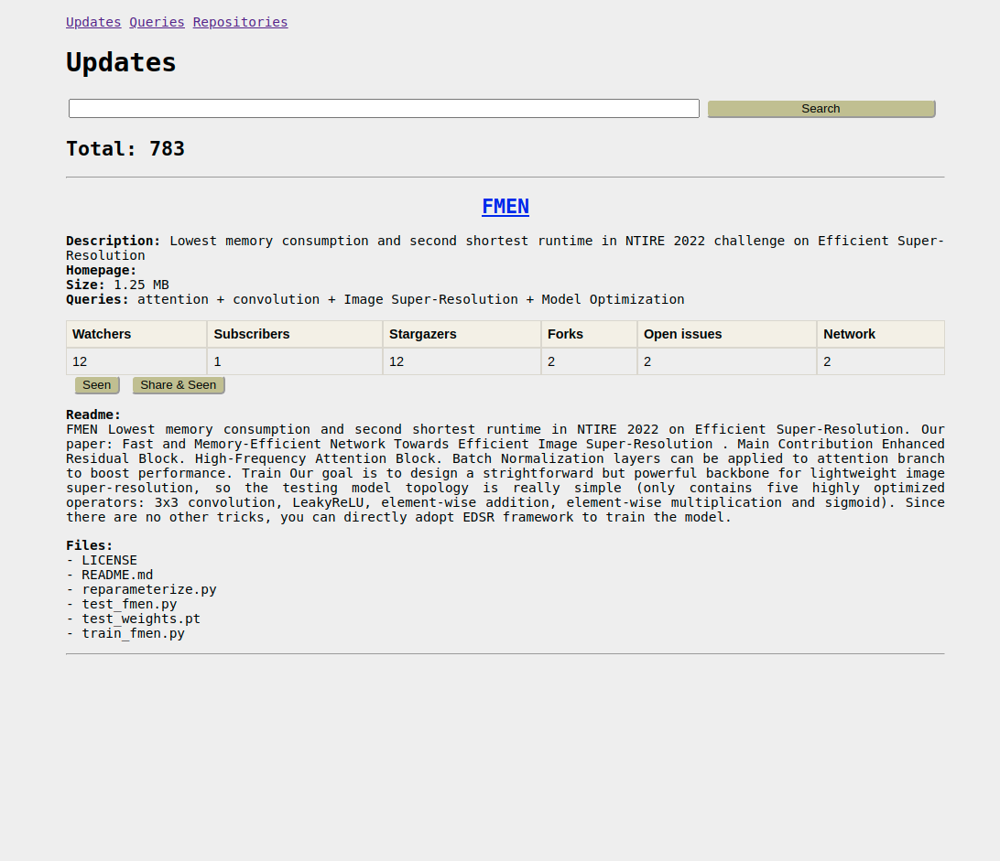

# informer

Simple python application, that parse, analyse, scrap anything new information about the latest researcher in machine learning related.

## Usage

Currently application supports the following features:
1. **autoupdate**: Auto-updating information every `n` seconds. Writes updates into simple sqlite3 database.
2. **web**: Web UI, to visualise updates in readable form (screenshot below).
3. **bot**: Telegram bot, that send updates to your personal telegram account and support autopost to the telegram channel.

You can enable or disable them in `config.yaml`.

1. Set up your parameters in `config.yaml`.
2. Run `run.py`.

## TODO

- [x] refactor SQL: optimize scripts architecture (peewee).
- [ ] web interface: add database backup interface.
- [ ] complete telegram bot code.
- [ ] refactor code: make possible to easily add new attributes to the repositories, that can be extracted by the algorithms. Currently, it is hard-coded in many files.
